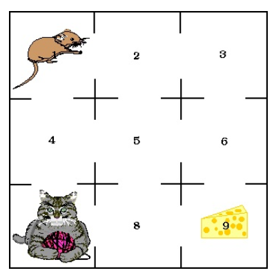

\centering
\raggedright
\begin{center}
```{r pressure, echo=FALSE,out.width = '25%',fig.align='center'}

```
{\Large {\bfseries Pacotes markvochain e diagram}}
\\
{\bfseries Grupo 3:}  Aline de Almeida Ramos, \\
                      Ananda Almeida de Sá, \\
                      Juliana Magalhães Rosa e \\
                      Khézia Ribeiro de Moura.
\end{center}
```{r setup, include=FALSE}
knitr::opts_chunk$set(echo = TRUE)
```

## Introdução

O pacote diagram é utilizado para a elaboração de gráficos simples baseados em matrizes de transição. Através dele é possível construir diagramas de fluxo, os chamados "grafos". Ao realizar a instalação do pacote é importante verificar se a versão do RStudio é no mínimo a 2.0.1.  

Já o pacote markovchain disponibiliza classes, métodos e funções que auxiliam na realização de análises probabibilísicas e estatísticas para lidar de maneira simples com Cadeias de Markov Discretas.  
Para o uso desse pacote, a versão mínima necessária do RStudio é a 3.6.0.

## Primeiros Passos

```{r}
#Carregando os pacotes
library(markovchain) 
library(diagram)
```

## Exemplo 1

Como primeiro exemplo, parte-se da seguinte matriz de transição:

$$
P = \begin{bmatrix}
0.8 & 0 & 0 & 0 & 0 & 0.2 & 0 \\
0 & 0 & 0 & 0 & 1 & 0 & 0 \\
0.1 & 0 & 0.9 & 0 & 0 & 0 & 0 \\
0 & 0 & 0 & 0.5 & 0 & 0 & 0.5 \\
0 & 0.3 & 0 & 0 & 0.7 & 0 & 0 \\
0 & 0 & 1 & 0 & 0 & 0 & 0 \\
0 & 0.5 & 0 & 0 & 0 & 0.5 & 0 
\end{bmatrix}
$$
Para fazer uso das funções que produzem gráficos ou fazem cálculos e verificações, primeiro é preciso criar o objeto da classe *markovchain*:

```{r}
#Montando a matriz de transição
matriz_transicao <- matrix(c(0.8, 0, 0, 0, 0, 0.2, 0, 0, 0, 0, 0, 1, 0, 0, 0.1, 0, 0.9, 0,
0, 0, 0, 0, 0, 0, 0.5, 0, 0, 0.5, 0, 0.3, 0, 0, 0.7, 0, 0, 0, 0, 1, 0, 0, 0, 0, 0, 0.5, 0,
0, 0, 0.5, 0), nrow=7, byrow=TRUE,
dimnames=list(c('0', '1', '2', '3', '4', '5', '6'), c('0', '1', '2', '3', '4', '5', '6')))

#Criando a cadeia de markov
cadeia_markov <- new("markovchain", states=c('0', '1', '2', '3', '4', '5', '6'),
         transitionMatrix=matriz_transicao)
cadeia_markov
```

Já para fazer o grafo das probabilidades de transição, é utilizado o pacote *diagram*:

```{r}
plotmat(t(matriz_transicao), pos=c(2, 3, 2), curve = 0.35, arr.len = 0.3, 
        arr.type = "simple", dtext = 0.95, box.size = 0.05, cex.txt = 0.45, 
        relsize=0.8, main="Grafo - Exemplo 1")
```

Através do link <https://www.rdocumentation.org/packages/diagram/versions/1.6.5/topics/plotmat>, é possível verificar de forma detalhada todos os elementos que podem ser alterados nos grafos. No gráfico acima foram feitas algumas mudanças através dos seguintes comandos:

* *pos* - é definido através de um único número positivo ou um vetor de números para se determinar quantos estados haverá por linha de forma ordenada. No exemplo dado, estão os dois primeiros estados na primeira linha, três estados na segunda e os outros dois na última;

* *curve* - controla a angulação das setas que conectam os grafos;

* *arr.len* - controla o tamanho das setas que conectam os grafos;

* *arr.type* - determina o formato das setas. No exemplo dado, é "simples";

* *dtext* - controla a posição do texto das setas em relação às pontas das setas;

* *cex.txt* - controla o tamanho do texto que acomapnha as setas;

* *box.size* - controla o tamanho das caixas dos estados;

* *relsize* - controla a escala do gráfico;

* *main* - define o título do gráfico.

Além disso, é possível fazer diversas operações com a cadeia, utilizando o pacote *markovchain*.  

Para uma verificação rápida do espaço de estados da cadeia:

```{r}
#Espaço de Estados
names(cadeia_markov)
states(cadeia_markov)
```

Pode-se calcular a matriz de n passos.  
Para n = 3:

```{r}
#Matriz de transição de 3 passos
P_3 <- cadeia_markov^3
P_3
```

Pode-se verificar se a cadeia possui estados absorventes,

```{r}
absorbingStates(cadeia_markov)
```
estados recorrentes,

```{r}
recurrentStates(cadeia_markov) #recorrentes
```

e estados transientes,

```{r}
transientStates(cadeia_markov) #transientes

```

Não existem estados absorventes. Apenas o 3 e o 6 são transientes e os demais são recorrentes.  

Conferindo quais são as classes de equivalência presentes na cadeia:

```{r}
communicatingClasses(cadeia_markov)
```

Há, então, as classes {0, 2, 5}, {1, 4}, {3} e {6}.  

E agora, suas classificações:

```{r}
#recorrentes
recurrentClasses(cadeia_markov)
#transientes
transientClasses(cadeia_markov)

```

Novamente, observa-se que apenas os estados 3 e 6, cada um formando uma classe, são os únicos transientes.  

Para obter, de forma rápida, probabilidades de transição $P_{ij}$:

```{r}
#Pij
transitionProbability(cadeia_markov, '1', '0') #i=1 e j=0
```

Para saber o período:

```{r}
#período para a classe (0, 2, 5)
period(new("markovchain", states=c('0', '2', '5'),
         transitionMatrix=matriz_transicao[c(1, 3, 6), c(1, 3, 6)]))
```

Quebrando a cadeia em classes, pode-se calcular o período de cada classe, como foi feito para a classe {0, 2, 5}, que é aperiódica.

```{r}
#período da cadeia
period(cadeia_markov)
```

Ao tentar calcular o período da classe toda, ocorre um erro. Isso se dá pois, para cadeias que não são irredutíveis, cada classe pode ter um período diferente (ou pode até ser aperiódica), então não existe um "período da cadeia".  

A função a seguir agrupa as classes por tipo, apresentando a matriz com as classes recorrentes primeiro e, ao final, as classes transientes.

```{r}
#matriz ordenada por classes recorrentes e transientes
canonicForm(cadeia_markov)
```

É possível chegar também às probabilidades marginais. É necessário usar apenas a função conditionalDistribution() com a cadeia como primeiro argumento e o estado para qual se deseja ver as probabilidades marginais como segundo. 

```{r}
#probabilidades marginais (linhas da matriz)
conditionalDistribution(cadeia_markov, '0')
```

Pode-se verificar também a probabilidade de, partindo do estado i, a primeira visita a cada estado ser em n transições, ou seja:

$$f_{ij}^{\left( n\right) }$$


```{r}
firstPassage(cadeia_markov, '0', 10) #i=0 e n=1, 2, 3, 4, 5, 6, 7, 8, 9, 10
```

Outra informação que pode ser checada é se determinados estados se comunicam. Ou seja, é possível verificar acessibilidade. 

```{r}
#Checando se 1 acessa 2
is.accessible(cadeia_markov, '1', '2') #i=1 e j=2
#Checando se 2 acessa 1
is.accessible(cadeia_markov, '2', '1') #i=2 e j=1
```

Nesse caso, nem o estado 1 acessa o 2 e nem o contrário. Ou seja, esses dois estados não comunicam-se entre si.

Verificando se uma cadeia é irredutível:

```{r}
#Checando irredutibilidade
is.irreducible(cadeia_markov)
```

Um outro valor interessante que pode ser obtido é o número médio de visitas ao estado j partindo do estado i.

```{r}
#Para cada combinação de i e j
meanNumVisits(cadeia_markov)
```

## Exemplo 2 - Rato no Labirinto

Como segundo exemplo, será usado o clássico problema de Cadeias de Markov que envolve um experimento com um rato em um labirinto.  Considere que um rato  é colocado em um dos compartimentos de um labirinto como apresentado na figura que está abaixo.  O rato move-se aleatoriamente entre os compartimentos com mesma probabilidade e o estado do sistema no instante $n$ é o número do compartimento em que ele se encontra neste instante.

```{r, echo=FALSE,out.width = '25%',fig.align='center'}

```

A matriz de transição, nesse caso, é dada por:

$$
P = \begin{bmatrix}
0 & 1/2 &  0 &  1/2 &  0 &  0 &  0 &  0 &  0 \\
1/3 &  0 &  1/3 &  0 &  1/3 &  0 &  0 &  0 &  0 \\
0 &  1/2 &  0 &  0 &  0 &  1/2 &  0 &  0 &  0 \\ 
1/3 &  0 &  0 &  0 &  1/3 &  0 &  1/3 &  0 &  0 \\
0 &  1/4 &  0 &  1/4 &  0 &  1/4 &  0 &  1/4 &  0 \\
0 &  0 &  1/3 &  0 &  1/3 &  0 &  0 &  0 &  1/3 \\
0 &  0 &  0 &  1/2 &  0 &  0 &  0 &  1/2 &  0 \\
0 &  0 &  0 &  0 &  1/3 &  0 &  1/3 &  0 &  1/3 \\
0 &  0 &  0 &  0 &  0 &  1/2 &  0 &  1/2 &  0
\end{bmatrix}
$$
Montando essa cadeia no R: 

```{r}
# Criando cadeia
matriz_rato <- matrix(c(0, 0.5, 0, 0.5, 0, 0, 0, 0, 0, 1/3, 0, 1/3, 0, 1/3, 0, 0, 0, 0, 0,
0.5, 0, 0, 0, 0.5, 0, 0, 0, 1/3, 0, 0, 0, 1/3, 0, 1/3, 0, 0, 0, 0.25, 0, 0.25, 0, 0.25, 0,
0.25, 0, 0, 0, 1/3, 0, 1/3, 0, 0, 0, 1/3, 0, 0, 0, 0.5, 0, 0, 0, 0.5, 0, 0, 0, 0, 0, 1/3,
0, 1/3, 0, 1/3, 0, 0, 0, 0, 0, 0.5, 0, 0.5, 0), nrow=9, byrow=TRUE, 
dimnames=list(c('1', '2', '3', '4', '5', '6', '7', '8', '9'),
c('1', '2', '3', '4', '5', '6', '7', '8', '9')))
cadeia_markov_rato <- new("markovchain", 
states=c('1', '2', '3', '4', '5', '6', '7', '8', '9'), transitionMatrix=matriz_rato)
cadeia_markov_rato
```

Novamente, para fazer o grafo, será usado o pacote *diagram*:

```{r}
#Criando o grafo
AA <- as.data.frame(matriz_rato)

plotmat(A = AA, pos = c(3, 3, 3), curve = 0.1, arr.len = 0.3, arr.type = "simple", 
        dtext = 0.95, box.size = 0.05, cex.txt = 0.45, relsize=0.8, 
        main = "Grafo - Exemplo 2 - Rato no Labirinto")
```

Primeiramente, confere-se a irredutibilidade dessa cadeia:

```{r}
is.irreducible(cadeia_markov_rato)
```

Sim, ela é irredutível! Então vale avaliar as classes dos estados usando o pacote *markovchain*:

```{r}
#classes de equivalência
recurrentClasses(cadeia_markov_rato) #recorrentes
```

Como era de se esperar de uma cadeia irredutível, há apenas uma classe de equivalência, que é a própria cadeia, com todos os estados recorrentes.

Como já visto anteriormente, para se chagar à matriz de transição a nove passos, basta aplicar:
```{r}
# Elevando a cadeia à nona potência
cadeia_9_passos <- cadeia_markov_rato ^ 9
cadeia_9_passos
```

Para encontrar a probabilidade de que, em nove passos, o rato esteja no compartimento 6 considerando que ele foi solto no compartimento 2, seria preciso calcular a seguinte probabilidade condicional:

$$
P(X_9 = 6 \ | \ X_0 = 2 ) = P_{26}^{(9)}
$$

Olhando para a segunda linha e sexta coluna da matriz de nove passos, conclui-se que:

$$
P_{26}^{(9)} = 0
$$
Logo, a probabilidade de que o rato esteja no compartimento 6 considerando que ele foi solto no 2 é nula.

Suponha que o rato pode ser solto, inicialmente, em qualquer um dos compartimentos. Qual será a probabilidade de que, em nove passos, o rato esteja no compartimento 6? Pode-se considerar que a probabilidade do rato estar solto inicialmente em qualquer um dos compartimentos é $\frac{1}{9}$. Então, tem-se o seguinte vetor inicial:

$$
{\alpha}_0 = [\frac{1}{9},\frac{1}{9},\frac{1}{9},\frac{1}{9},\frac{1}{9},\frac{1}{9}, \frac{1}{9},\frac{1}{9},\frac{1}{9}]
$$
Portanto, a probabilidade de interesse será dada por:

$$
P(X_9 = 6 ) = {\alpha}_0 .[\text{coluna 6 de} \ P^9]
$$

Aplicando no R:
```{r}
# Definindo alpha0
a_0 <- c(1/9,1/9,1/9,1/9,1/9,1/9,1/9,1/9,1/9)
# Definindo a coluna 6 de p^9
coluna6 <- cadeia_9_passos[,6]
# Fazendo o cálculo
sum(a_0 * coluna6)
```

Portanto, a probabilidade de que o rato esteja no compartimento 6 depois de 9 transições é de aproximadamente 13,89%.

Calculando as matrizes de transição de 100 a 103 passos:

```{r}
# Elevando a cadeia na potência desejada
cadeia_100_passos <- cadeia_markov_rato ^ 100
cadeia_100_passos
```

As cadeias de 100 passos e de 102 passos são iguais, conforme o código abaixo indica:

```{r}
cadeia_100_passos == cadeia_markov_rato ^ 102
```

Cadeia de 101 passos:

```{r}
# E
cadeia_101_passos <- cadeia_markov_rato ^ 101
cadeia_101_passos
```

As cadeias de 101 passos e de 103 passos também são iguais entre si, conforme o código abaixo indica:

```{r}
cadeia_101_passos == cadeia_markov_rato ^ 103
```

As matrizes acima são similares, pois possuem os mesmos números, mas em posições distintas.

No caso das matrizes de 100 e 102 passos, as colunas pares possuem linhas ímpares nulas e as colunas ímpares possuem linhas pares nulas. As matrizes de 101 e 103 passos são exatamente o oposto disso: colunas ímpares possuem linhas ímpares nulas e colunas pares possuem linhas pares nulas.

Parece que a tendência da cadeia é ir alternando entre esses dois modelos de matriz de transição a n passos à medida que aumenta-se o valor de n.

Para achar o período da cadeia, basta um comando simples:

```{r}
period(cadeia_markov_rato)
```

Agora sim dá certo calcular o período da cadeia, uma vez que essa é irredutível!

## Exemplo 3

Uma aranha, tentando caçar uma mosca, move-se entre as localizações 1 e 2 de acordo com uma Cadeia de Markov com matriz de transição dada a seguir:

$$
Q = \begin{bmatrix}
0.7 & 0.3  \\
0.3 & 0.7
\end{bmatrix}
$$

Por outro lado, a mosca que  não se dá conta da presença da aranha, move-se de acordo com uma Cadeia de Markov com a seguinte matriz de transição:

$$
R = \begin{bmatrix}
0.4 & 0.6  \\
0.6 & 0.4
\end{bmatrix}
$$

É possível montar uma Cadeia de Markov que represente essa caçada.

Pode-se considerar 3 estados: **A1M2** para quando a aranha está em 1 e a mosca em 2; **A2M1** para quando a aranha está em 2 e a mosca em 1; **Fim** para quando a caçada termina (aranha e mosca estão na mesma posição - ambas em 1 ou ambas em 2).

Para isso, serão calculadas algumas probabilidades:

```{r}
#Se a aranha começa em 1 (A1) e a mosca em 2 (M2)
##Probabilidade de as duas continuarem nessas posições
P_A1M2_A1M2 <- 0.7*0.4 #aranha continua em 1 * mosca continua em 2
##Probabilidade de as duas trocarem de posições
P_A1M2_A2M1 <- 0.3*0.6 #aranha muda para 2 * mosca muda para 1
##Probabilidade de que a aranha pegue a mosca
P_A1M2_Fim <- 0.7*0.6+0.3*0.4 #aranha continua em 1 * mosca muda para 1 
                              #+ aranha muda para 2 * mosca continua em 2
```

Com isso, foi calulada a primeira linha da nossa matriz de transição, pois foram considerados todos os estados nos quais é possível chegar partindo do primeiro estado A1M2.

Verificando essa linha 1:

```{r}
linha1 <- c(P_A1M2_A1M2, P_A1M2_A2M1, P_A1M2_Fim)
linha1
```


Fazendo o mesmo para a segunda linha:

```{r}
#Se a aranha começa em 2 (A2) e a mosca em 1 (M1)
##Probabilidade de as duas trocarem de posições
P_A2M1_A1M2 <- 0.3*0.6 #aranha muda para 1 * mosca muda para 2
##Probabilidade de as duas continuarem nessas posições
P_A2M1_A2M1 <- 0.7*0.4 #aranha continua em 2 * mosca continua em 1
##Probabilidade de que a aranha pegue a mosca
P_A2M1_Fim <- 0.7*0.6+0.3*0.4 #aranha continua em 2 * mosca muda para 2 
                              #+ aranha muda para 1 * mosca continua em 1
```

Olhando a linha 2:

```{r}
linha2 <- c(P_A2M1_A1M2, P_A2M1_A2M1, P_A2M1_Fim)
linha2
```

E por fim, a terceira linha é quando parte-se do terceiro estado, que é "Fim". Nesse caso, a caçada já acabou, então as probabilidades de mudar para os outros estados são nulas e a probabilidade de permanecer no estado "Fim" é unitária.

```{r}
linha3 <- c(0, 0, 1)
linha3
```

Daí, monta-se finalmente a cadeia:

```{r}
matriz_cacada <- matrix(append(append(linha1, linha2), linha3), nrow=3, byrow=TRUE,
dimnames=list(c("A1M2", "A2M1", "Fim"), c("A1M2", "A2M1", "Fim")))

#Criando a cadeia de markov
cadeia_markov_cacada <- new("markovchain", states=c("A1M2", "A2M1", "Fim"),
         transitionMatrix=matriz_cacada)
cadeia_markov_cacada
```

Para melhor visualização dessa caçada, segue o grafo da cadeia:

```{r}
plotmat(t(matriz_cacada), pos = 3, curve = 0.5, arr.len = 0.3, 
        arr.type = "simple", dtext = 0.95, box.size = 0.07, cex.txt = 0.55, 
        relsize=0.9, main="Grafo da Caçada da Aranha pela Mosca")
```

Esse exemplo final foi interessante para mostrar como é possível montar uma Cadeia de Markov a partir de 2 cadeias que se relacionam por contexto.